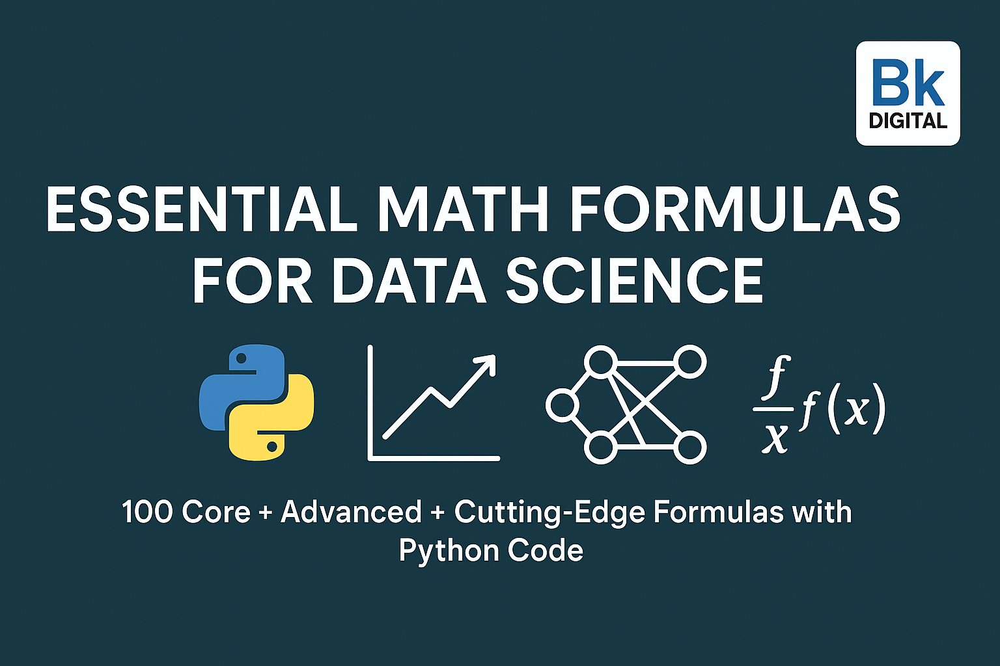

# Essential Math Formulas for Data Science

A curated collection of **100 Core, Advanced, and Cutting-Edge Mathematical Formulas** that power modern Data Science, Machine Learning, Deep Learning, and AI.

Each formula includes:
- 📈 Mathematical representation (LaTeX)
- 🧠 Intuition / Explanation
- 🚀 Real-world Data Science Use Case
- 🐍 Python Code Snippet
- 🏷️ Relevant Data Science Tags (NLP, Forecasting, Clustering, RL, etc.)

---

# 📚 Sections

## 1. Classic Formulas (Entries 1–26)
Foundational concepts like Gradient Descent, Normal Distribution, Z-score, Sigmoid, Correlation, RMSE, etc.

## 2. Advanced Formulas (Entries 27–70)
Real-world workhorse methods: Matrix Factorization, TF-IDF, Policy Gradient, ROC-AUC, KKT Conditions, Adam Optimizer.

## 3. Cutting-Edge Formulas (Entries 71–100)
Latest breakthroughs for 2025+: Attention Mechanism, SHAP Values, Neural ODEs, Diffusion Models, Self-Supervised Learning.

---

# 🚀 About
This repository is built for Data Scientists, ML Engineers, Researchers, and anyone who believes **Mathematics fuels Machine Learning**.

- **Author:** Bikram Keshari Samal (Bk Digital)
- **License:** MIT License
- **Status:** Actively maintained and updated with emerging trends.
- **Tagline:** “Mathematics fuels Machine Learning.”

---

# 📌 Quick Links
- [My GitHub Profile](https://github.com/bikramtheitguy)
- [Connect on LinkedIn](https://linkedin.com/in/bikram-keshari-samal-3975222a5)
- [BK Digital Website](https://bkdigital.tech) (Coming Soon)

---

⭐ If you find this useful, don't forget to Star this repository and Share!
